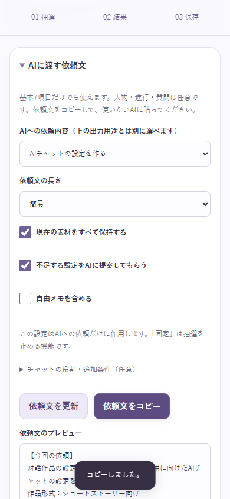
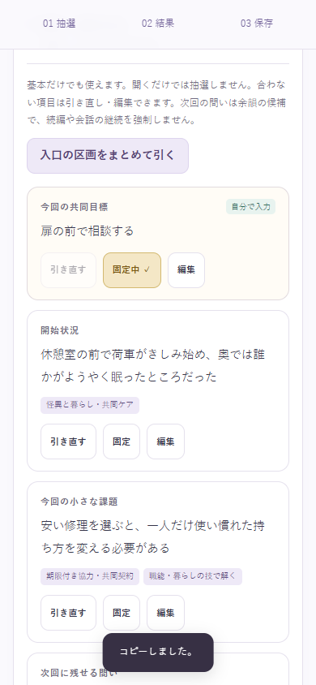
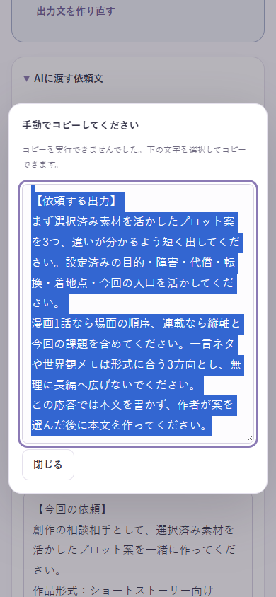

# 第4回改修：AIへ渡す依頼文・会話と1話の入口

検証日：2026-10-05（日本時間）。着手前にGitHubからmainを取得し、指示書記載の af4728bcd6907c9d8678dc920a7fe2e6595dee13 と一致を確認。作業ツリーは変更なし、適用対象のAGENTS.mdはありませんでした。

## A→B→Cの完了範囲

Aは4目的×2長さの純粋な依頼文生成、要約から開くパネル、プレビュー・文字数・コピー、保存オプションを実装し、専用Node検証5件が成功。Bは入口4項目64候補を独立区画として接続し、履歴・保存・編集・クリアのNode検証2件とA/Bの画面10項目が成功。その後Cで4テーマ・横断素材・追加背景を統合し、既存検証も含めて再実行しました。指示書A〜Cの未実装項目はありません。実機確認の限界は後述します。

追加依頼の「すべてのロックを外す」「テーマの選択を全解除」は、主抽選ボタンの直下に常時表示します。ロック解除は基本・人物・進行・入口・全区分の質問を対象にし、本文や回答は消しません。回答済み質問はロック解除後も通常の再抽選では保護されます。テーマ解除は最大3つの選択をお任せへ戻します。どちらも素材を再抽選せず、履歴で戻せます。

## AIへ渡す操作と8パターン

要約カードの「AIに渡して続きを作る」から、任意区画より上のパネルを開きます。基本7項目だけで使える案内を表示。人物・進行・質問・会話の入口は任意です。最初に開く時だけ、作品用途がAIキャラならchat、それ以外はstoryを提案し、その後は用途を変えても手動選択を維持します。

| 目的 | 簡易 | 詳細 |
| --- | --- | --- |
| 物語・プロット | 選んだ形式で違いの分かる3案。本文は選択後 | 同じ依頼と全素材に、現在の用途別構成案を追加 |
| AIチャット設定 | 世界・人物・関係・開始状況・進行ルール・導入案。確認前にRPを始めない | 構成案と、不足部分の共同目標・情報差・関係の変化等の設計案も依頼 |
| 壁打ち | 確認点と質問を各最大3件、素材を残してつなぐ案 | 現在の構成案も参考として相談 |
| 設定資料 | 保持内容・抽選素材・提案・未決を区別し、秘密を公開紹介へ流用しない | 用途別構成案も分離して添付 |

簡易でも選んだ素材・回答は省略しません。自由メモは初期OFF、ONなら全文を資料として引用します。保持ONでは抽選素材も保持、OFFでもまず活かし変更は理由付き提案とします。手入力はロック解除後も保持したい設定。legacyは作者の決定と推測せず現在の素材として扱います。空の項目・未回答質問は省略し、回答の迷いも改変しません。補完OFFでは確定補完せず最大3件の確認を依頼します。

chatの任意設定はユーザー役／AI担当／その他役割100文字／追加条件2,000文字。役割衝突はその場で表示して入力を保持し、更新・コピー・保存を止めます。複数人物はユーザーの発言・行動を代行せず、集団を恋人二人に固定しません。作者向けの秘密と初期公開情報を分け、結末や次回の問いで会話を強制しません。追加条件は素材資料と区別して作者の指示として渡します。

生成元はstateで、保存済みmemoの逆解析はしません。coreから用途別構成案の純粋関数を抽出し、新しい参考案だけを生成します。元の保存済みmemoは読み込みで作り直しません。詳細版は要約・全設定・memoの三重貼付をせず、設定と構成案を分離します。

## 一括反映・保存・失敗時

更新とコピーは既存prepareDrafts／requireAppliedを通り、本文・短語・背景・非表示区分の回答・名前・メモ・AI追加条件を一括検証。1件でも不正なら全体を止め、入力を残して該当欄を開きます。オプション変更だけでは本文下書きを確定せず、未反映案内を出します。コピー直前に現在値から再生成し、プレビュー・全文の文字数・コピーを一致させます。文字数はUnicodeコードポイント（Array.from）、保存時の入力上限は既存と同じ文字列lengthで検証します。

コピー失敗時は同じ全文を読み取り用の手動コピー欄へ出します。HTMLはtextarea.valueで表示し、実行しません。長い依頼文のコピーは制限せず、外部AIの固定文字数上限も設定しません。IME変換中の操作は既存ガードを利用し、blurでは確定・コピーしません。

handoffとsceneはschemaVersion2のまま作業中状態・作品・別名保存・JSON・履歴で保持。旧v2の欠損値は既定値とnullに補い、旧形式の文章・名前・回答・固定を再生成しません。AI依頼文そのものは派生値で、8パターン全部を保存しません。容量不足は元作品の成功扱いにせず、現在のメモリからAI依頼文とJSONを持ち出せます。AIコピーで全作品JSONバックアップ日時は変わりません。

## 新規素材の件数

| カテゴリ | 追加前 | 新規 | 現在 |
| --- | --- | --- | --- |
| 世界観 | 181 | 24 | 205 |
| ジャンル | 80 | 4 | 84 |
| 関係性 | 156 | 28 | 184 |
| 中心事件 | 118 | 24 | 142 |
| 葛藤 | 137 | 24 | 161 |
| ギミック | 148 | 20 | 168 |
| ひねり | 124 | 20 | 144 |

基本944→1,088件、テーマ16→20。新規定義は基本144＋入口64＋共有人物28＋進行28＋質問12＝276件。共有人物は主人公・相手役へ56枠として展開します。タグ補完や展開を新規定義へ二重計上していません。今回、既存候補への新タグ補完は0件です。既存1,346候補の全属性・旧16テーマ・質問92件の本文とIDを変更前データと照合して維持を確認しました。

| 主分類 | 世界 | ジャンル | 関係 | 事件 | 葛藤 | 仕掛け | ひねり | 計 |
| --- | --- | --- | --- | --- | --- | --- | --- | --- |
| 記録・記憶・証言の謎 | 4 | 1 | 5 | 4 | 4 | 3 | 3 | 24 |
| 怪異と暮らし・共同ケア | 4 | 1 | 5 | 4 | 4 | 3 | 3 | 24 |
| 期限付き協力・共同契約 | 4 | 1 | 5 | 4 | 4 | 3 | 3 | 24 |
| 職能・暮らしの技で解く | 4 | 1 | 5 | 4 | 4 | 3 | 3 | 24 |
| 横断：獣人・人外 | 2 | 0 | 2 | 2 | 2 | 2 | 2 | 12 |
| 横断：砂漠・監査 | 2 | 0 | 2 | 2 | 2 | 2 | 2 | 12 |
| 横断：SF・AI | 2 | 0 | 2 | 2 | 2 | 2 | 2 | 12 |
| 横断：疑似家族・旅 | 2 | 0 | 2 | 2 | 2 | 2 | 2 | 12 |

新4テーマはそれぞれ24件、横断4系統はそれぞれ12件。新しい葛藤・ひねりの明示リンクは12組。関係性28件中、恋愛タグのないもの26件、group8件です。配分は主分類で一度だけ集計し、複数タグで水増ししていません。

各トーンの対応件数（同じ候補を複数列に数えます）：

| 主分類 | 1 | 2 | 3 | 4 | 5 |
| --- | --- | --- | --- | --- | --- |
| 記録・記憶・証言の謎 | 8 | 21 | 22 | 24 | 2 |
| 怪異と暮らし・共同ケア | 9 | 20 | 23 | 24 | 5 |
| 期限付き協力・共同契約 | 14 | 21 | 22 | 24 | 3 |
| 職能・暮らしの技で解く | 15 | 21 | 22 | 24 | 2 |
| 横断：獣人・人外 | 7 | 12 | 12 | 12 | 0 |
| 横断：砂漠・監査 | 7 | 12 | 12 | 12 | 0 |
| 横断：SF・AI | 2 | 10 | 11 | 12 | 1 |
| 横断：疑似家族・旅 | 7 | 11 | 11 | 12 | 1 |

| 追加カテゴリ | 新規定義 | 1 | 2 | 3 | 4 | 5 |
| --- | --- | --- | --- | --- | --- | --- |
| scene.goal | 16 | 8 | 14 | 16 | 14 | 2 |
| scene.opening | 16 | 8 | 14 | 16 | 14 | 2 |
| scene.problem | 16 | 6 | 14 | 16 | 15 | 2 |
| scene.question | 16 | 10 | 14 | 16 | 15 | 2 |
| 共有人物 role | 12 | 7 | 11 | 12 | 12 | 1 |
| 共有人物 goal | 8 | 2 | 7 | 8 | 8 | 0 |
| 共有人物 secret | 8 | 0 | 6 | 8 | 8 | 1 |
| deadline | 8 | 5 | 6 | 8 | 8 | 2 |
| obstacle | 8 | 4 | 7 | 8 | 8 | 1 |
| cost | 6 | 0 | 3 | 4 | 6 | 3 |
| ending | 6 | 4 | 4 | 5 | 6 | 2 |

質問は既存4区分へ各3件、現在各26件。人物候補は役割各52、目的・秘密各48。進行は期限44、障害44、代償48、結末54です。

重複点検では全文一致をカテゴリごとに確認し、文字2連接の近似比較を手がかりに旧4パックの近い本文と役割・利害・解決手段を読み比べました。「記憶を返すか本人の選択を尊重するか」は旧候補に近いため、複製の保全期限と閲覧権限の再同意へ変更。階段の精霊は移動設備自身の休息、獣人は改名・許可証・感覚証言の条件、砂漠は実測監査、AIは異議申立ての資格と人格複製の権利へ焦点を変えています。語句の近似率を意味上の独自性の証明とは扱っていません。

## 背景・抽選・区画

背景は旧8種を保ち、自律AI・記憶人格保存／編集・未来記録の3種を追加。技術候補にはmagicを無条件で要求せず、魔法を明記する新素材はmagic、AIや未来記録などが必須ならそれぞれのrequiresContextで制約します。候補が必要とする背景を世界が明示したときだけ使い、テーマ選択や手入力の語から存在を推定しません。全新規定義の背景到達可能性を検査しました。

STAGESの大分類は増やしません。題材辞書は9種を追加し、既存の題材も再利用。新規構造リンクは既知リンク集合へ接続し、scene同士にも一致重みを使います。自由に混ぜるではその追加倍率は1。最大3テーマ・OR型・既存の基本3カテゴリ／主要2カテゴリ優先枠・固定・直前除外を維持します。新4テーマ×2方針×4トーン×12シードの384条件で基本と入口を検証しました。

人物6・進行4・入口4のキー一覧を明示して区画を分離し、進行ボタンへsceneが混ざらないようにしました。基本主抽選は7項目のまま。入口は個別／まとめ抽選・編集・固定・クリア・履歴に対応し、開くだけでは生成しません。因果関係の自動完成は保証せず、個別の調整を案内します。

## 実際に行った検証と限界

- Node.js 24：61件成功、失敗0。既存49件も最終データで再実行。コマンド：node --test --test-isolation=none tests/*.test.js。
- GitHubで旧テストの乱数依存が判明したため修正。素材本文の「二人」をテンプレートの決めつけと誤判定しないよう、素材保持と生成表現を分離して固定乱数で検証しました。通常の子プロセス分離モードでも61件成功。
- Chrome／Playwright：55項目成功、未処理の実行エラー0。既存42項目と今回13項目。GitHub Pagesと同じサブパスを使って確認。
- 360／390／430pxとPC1280px、プレビュー内スクロール、画面高さ縮小、入力フォーカス、模擬IME、コピー失敗、容量不足、旧v2欠損、新背景とAI設定の保存・復元を確認。
- 実機iPhone・Safari・本物のソフトキーボード／日本語IMEは未検証。モバイル相当のChrome検証を実機確認とは呼びません。
- 外部AIは呼び出しておらず、サービスごとの応答品質・形式遵守は未検証です。依頼文の生成・表示・コピーまでを確認しています。

## 実例と画面

[指定6種類の依頼文全文](./docs/round4/AI-SAMPLES.md)を通常抽選・固定・編集のstateから生成しました。全文を読み、素材欠落、名前重複、役割の逆転、資料と指示の区別を確認。抽選したままの意外な組み合わせも残し、都合のよい完成設定に置き換えていません。漫画例は入口の目標・小さな課題・問いを構成案にも利用します。

