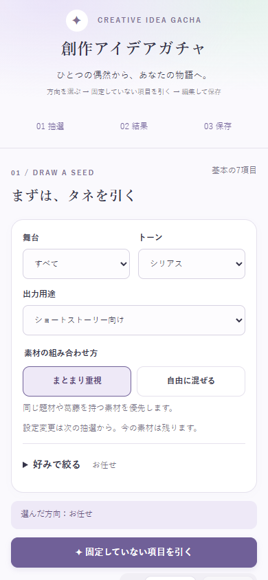
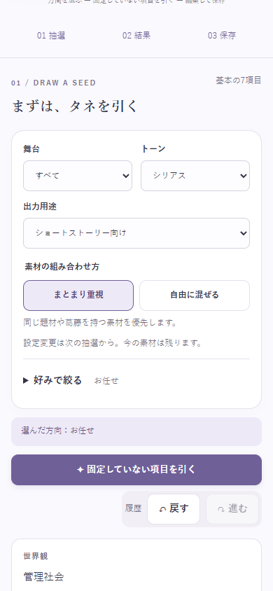
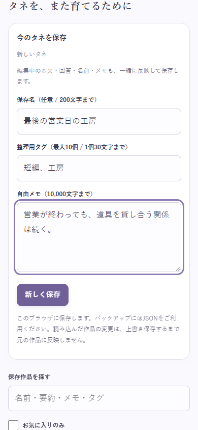
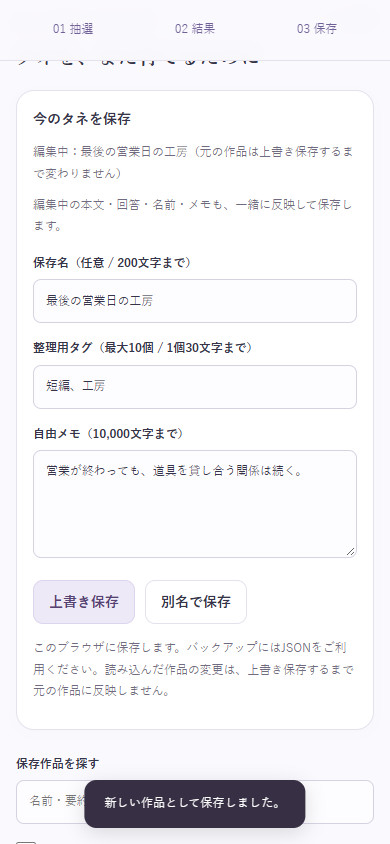
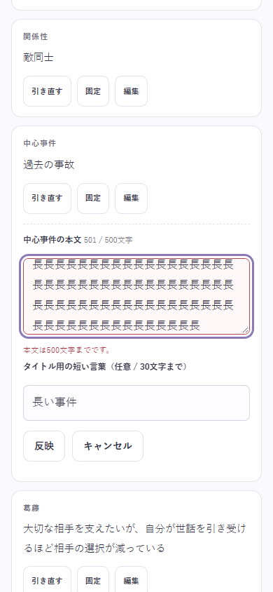
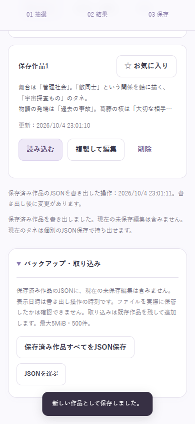

# 第3回改修：編集の一括反映・まとまり・物語素材

検証日：2026-10-04（日本時間）。変更前main：9bd64d2fcab01c45d30b5cd35926460a9a174d5a。

仕様書A〜Cを実装しました。保存・出力時の編集の一括反映、選べる抽選方針、物語素材132件の追加、主操作と説明の整理、保存済み作品のバックアップ案内が対象です。外部AI・クラウド保存・自動で整合した小説を完成させる機能は対象外です。

## 編集と保存

本文、タイトル用短語、世界観の背景チェック、非表示区分を含む質問回答、人物名、保存名、タグ、自由メモを、複製した状態にまとめて検証・反映します。新規保存・上書き・別名保存・読み込み前の保存、要約／メモ／ヒント／タイトル／Markdownのコピー、現在JSON・Markdown保存、文章の組み直し・タイトル生成で共通処理を使います。

1件でも不正なら部分反映や保存をせず、入力を残して最初のエラーを開きフォーカスします。一括編集は履歴1回分です。保存作品IDの変更は編集とは別の履歴になります。関連しないヒントとタイトルは一括反映だけでは引き直しません。開いただけの編集欄は手入力・固定へ変わりません。履歴で元の質問が消えた場合も、編集中の回答と元の質問を一緒に復元します。

保存容量不足では、反映済みの現在状態をメモリと出力用に保持し、元の保存作品・保存IDを保ちます。読み込み確認のキャンセルは下書きを残し、個別取消はその欄だけを戻します。IME変換中のEnter・操作クリックとblurによる二重反映を防ぎます。

「保存済み作品すべてをJSON保存」は保存済み一覧だけを出力します。不正な現在下書きがあっても利用でき、未保存編集は含めません。表示する日時は書き出し操作の時刻で、実際のファイル保管を確認した時刻ではありません。保存内容が5回変わると案内し、閉じた同じ状態では繰り返しません。現在JSONとMarkdownはこの日時を更新しません。補助情報の保存失敗は作品保存を失敗させません。

## 新規素材と既存補完

| カテゴリ | 追加前 | 新規 | 現在 |
| --- | --- | --- | --- |
| 世界観 | 175 | 6 | 181 |
| ジャンル | 70 | 10 | 80 |
| 関係性 | 150 | 6 | 156 |
| 中心事件 | 112 | 6 | 118 |
| 葛藤 | 97 | 40 | 137 |
| ギミック | 142 | 6 | 148 |
| ひねり | 84 | 40 | 124 |

基本は830→944件（新規114件）。加えて結末12件・代償6件、全体で新規132件です。人物は6項目各40件、期限と障害は各36件、代償42件、結末48件、質問は4区分各23件です。

| 分類 | 葛藤 | ひねり | 対応ペア |
| --- | --- | --- | --- |
| beastfolk | 6 | 6 | 5 |
| desert-court | 6 | 6 | 5 |
| romantasy | 6 | 6 | 5 |
| cozy-fantasy | 6 | 6 | 5 |
| general | 8 | 8 | 5 |
| bonds | 8 | 8 | 5 |

対応ペア30組のうち、両候補がトーン1または2に対応するもの22組、4または5に対応するもの30組。対応は抽選の重みに使い、セットを強制しません。日常の追加28件は世界観6・ジャンル4・関係6・事件6・ギミック6。別途、日常に寄せないトーン5対応ジャンル6件を追加しました。

以下は新規候補のトーン別対応件数です。複数トーンの候補は各列に数えます。

| カテゴリ | 新規数 | 1 | 2 | 3 | 4 | 5 |
| --- | --- | --- | --- | --- | --- | --- |
| world | 6 | 0 | 5 | 6 | 6 | 0 |
| genre | 10 | 0 | 4 | 4 | 10 | 6 |
| relation | 6 | 0 | 5 | 6 | 6 | 0 |
| incident | 6 | 0 | 5 | 6 | 6 | 0 |
| conflict | 40 | 10 | 32 | 40 | 40 | 10 |
| gimmick | 6 | 0 | 5 | 6 | 6 | 0 |
| twist | 40 | 9 | 31 | 40 | 40 | 12 |
| ending | 12 | 0 | 8 | 12 | 12 | 6 |
| cost | 6 | 0 | 4 | 6 | 6 | 5 |

既存基本300件に題材タグを補い、既存の葛藤・ひねり77件に構造リンクを補いました。共有人物60定義にも題材タグを補い、うち9定義に構造リンクを補いました（主人公・相手役へ展開）。これらは新規件数に含めません。変更前の基本・人物・進行1214件の既存属性と質問92件のID・本文を照合し、維持を確認しました。

## 抽選方針と互換性

新規利用は「まとまり重視」、coherenceのない既存v2と旧形式は「自由に混ぜる」。切り替えだけで現在の素材は変わりません。まとまり重視では世界観・固定素材・選択テーマから最大2題材へ絞り、早めに引く関係・事件も後続の重みに使います。topicMatchは3倍、plotLinkMatchは4倍、関係・事件の題材一致は1.5倍、合わせた倍率の上限は8倍。自由に混ぜるでは追加の題材・構造倍率を1とします。AIキャラ用途のpair優先は共通で1.3倍、groupも排除しません。

背景・トーン・固定・直前除外を先に守り、既存のテーマ優先枠（基本3カテゴリ・主要2カテゴリ、候補がある選択テーマの反映）を適用した候補内で重みを使います。候補不足は有限の候補走査で終え、固定や背景・トーンによる不足理由を表示します。日常＋トーン5は説明と「トーン4へ変更」ボタンを出し、勝手に設定や素材を変えません。

旧JSONの新タグはgeneratedの候補IDからのみ補完し、保存本文から推定しません。手入力・旧文面は勝手に分類しません。未知タグは制限内で保持し、抽選では中立。schemaVersionは2のまま、保存文・タイトル・回答・固定・お気に入り・IDを読み込みだけで再生成しません。Markdownには日本語の抽選方針だけを記載します。

## 同じ設定・固定シードでの実例

各組は同じ世界観を固定し、舞台・トーン・テーマ・乱数初期値を合わせています。抽選順と重みが異なるため、同じ候補列になるものではありません。題材や構造の一致は物語の品質や因果関係の保証ではありません。要約は素材を無理に助詞で連結せず、引用とラベルで区切ります。

### 水利と宮廷（シード104、トーン3）

テーマ：desert-court。

| 項目 | まとまり重視 | 自由に混ぜる |
| --- | --- | --- |
| 世界観 | 巨大な地下水路を共同管理する砂漠王国 | 巨大な地下水路を共同管理する砂漠王国 |
| ジャンル | 暮らしの技を受け継ぐ物語 | ロードストーリー |
| 関係性 | 人ならざるものと契約者 | 王族と護衛 |
| 中心事件 | 婚約者の共同水利契約に未承認の条項が見つかる | 政治婚と外交協定を分ける議案が出される |
| 葛藤 | 国の水利を守りたいが婚約者を役目で縛りたくない | 宮廷の味を守りたいが民の料理にも耳を傾けたい |
| ギミック | 風向きで差し替える季節の隊商路標 | 移動する宮廷に携帯される各オアシスの法帳 |
| ひねり | 古い記録に挟まった空白の頁は、後世の人が自分の結論を書くため残されていた | 失敗した計画の備品が、思いがけない避難の場を支えていた |

**まとまり重視の要約**

舞台は「巨大な地下水路を共同管理する砂漠王国」。「人ならざるものと契約者」という関係を軸に描く、「暮らしの技を受け継ぐ物語」のタネ。
物語の発端は「婚約者の共同水利契約に未承認の条項が見つかる」。葛藤の核は「国の水利を守りたいが婚約者を役目で縛りたくない」。
望みがぶつかる場面で、何を選ぶのかを考えてみる。

**自由に混ぜるの要約**

舞台は「巨大な地下水路を共同管理する砂漠王国」。「王族と護衛」という関係を軸に描く、「ロードストーリー」のタネ。
物語の発端は「政治婚と外交協定を分ける議案が出される」。葛藤の核は「宮廷の味を守りたいが民の料理にも耳を傾けたい」。
望みがぶつかる場面で、何を選ぶのかを考えてみる。

### 店と引継ぎ（シード205、トーン4）

テーマ：cozy-fantasy。

| 項目 | まとまり重視 | 自由に混ぜる |
| --- | --- | --- |
| 世界観 | 修理の技術を次世代へ渡す最後の冬を迎えた魔法工房の町 | 修理の技術を次世代へ渡す最後の冬を迎えた魔法工房の町 |
| ジャンル | 失った日常を少しずつ作り直す物語 | 失った日常を少しずつ作り直す物語 |
| 関係性 | 夢の郵便を届ける配達員と眠りの浅い住人 | 店の契約終了後も同居を選び直す相手同士 |
| 中心事件 | 共同住宅を出る住人が最後の食事当番を引き受ける | 閉店前の店へ預かり品の持ち主たちが違う日に訪ねてくる |
| 葛藤 | 預かった記憶を返したいが持ち主の今の選択も尊重したい | 共同住宅を離れる住人を送り出したいが、自分だけ取り残される寂しさを隠せない |
| ギミック | 閉店した店の道具を近隣で貸し合う保管棚 | 封印 |
| ひねり | 返却する家の鍵とは別に、契約の当事者が自由に招待し合う食卓の取り決めを作れた | 修理を学んだ弟子の旅先には、冬のあいだ町で使わない道具を直せる仕事場があった |

**まとまり重視の要約**

舞台は「修理の技術を次世代へ渡す最後の冬を迎えた魔法工房の町」。「夢の郵便を届ける配達員と眠りの浅い住人」という関係を軸に描く、「失った日常を少しずつ作り直す物語」のタネ。
物語の発端は「共同住宅を出る住人が最後の食事当番を引き受ける」。葛藤の核は「預かった記憶を返したいが持ち主の今の選択も尊重したい」。
選択によって変わる信頼や、失われるものを考えてみる。

**自由に混ぜるの要約**

舞台は「修理の技術を次世代へ渡す最後の冬を迎えた魔法工房の町」。「店の契約終了後も同居を選び直す相手同士」という関係を軸に描く、「失った日常を少しずつ作り直す物語」のタネ。
物語の発端は「閉店前の店へ預かり品の持ち主たちが違う日に訪ねてくる」。葛藤の核は「共同住宅を離れる住人を送り出したいが、自分だけ取り残される寂しさを隠せない」。
選択によって変わる信頼や、失われるものを考えてみる。

### 獣人・砂漠・契約（シード306、トーン3）

テーマ：beastfolk / desert-court / romantasy。

| 項目 | まとまり重視 | 自由に混ぜる |
| --- | --- | --- |
| 世界観 | 獣人の王族が婚姻の守護契約を交渉するオアシス連合 | 獣人の王族が婚姻の守護契約を交渉するオアシス連合 |
| ジャンル | 魔法の仕事もの | 砂漠の暮らしの物語 |
| 関係性 | 古い隊商路を調べる宿場の子どもたち | 二国の水利協定を交渉する政略婚の跡継ぎ同士 |
| 中心事件 | 婚約者の共同水利契約に未承認の条項が見つかる | 魔法商店の最後の棚を誰に託すか話し合う日が来る |
| 葛藤 | 国を守る役目と相手の自由を両立させたい | 古い法を守ると隣のオアシスの住民を締め出してしまう |
| ギミック | 移動する宮廷に携帯される各オアシスの法帳 | 修理した場所を各地の職人が追記する地下水路図 |
| ひねり | 国境魔法は婚約者だけでなく住民の協力でも保てた | 敵意の印だと思った品は別種族の歓迎の贈り物だった |

**まとまり重視の要約**

舞台は「獣人の王族が婚姻の守護契約を交渉するオアシス連合」。「古い隊商路を調べる宿場の子どもたち」という関係を軸に描く、「魔法の仕事もの」のタネ。
物語の発端は「婚約者の共同水利契約に未承認の条項が見つかる」。葛藤の核は「国を守る役目と相手の自由を両立させたい」。
望みがぶつかる場面で、何を選ぶのかを考えてみる。

**自由に混ぜるの要約**

舞台は「獣人の王族が婚姻の守護契約を交渉するオアシス連合」。「二国の水利協定を交渉する政略婚の跡継ぎ同士」という関係を軸に描く、「砂漠の暮らしの物語」のタネ。
物語の発端は「魔法商店の最後の棚を誰に託すか話し合う日が来る」。葛藤の核は「古い法を守ると隣のオアシスの住民を締め出してしまう」。
望みがぶつかる場面で、何を選ぶのかを考えてみる。

## 実行した検証

- Node.js 24：49件成功、0失敗（node --test --test-isolation=none tests/*.test.js）。今回の実装で再実行。
- Chrome／Playwright：42項目成功、未処理エラー0。既存28項目と今回14項目を同じ実行で確認。
- 360／390／430px、PC 1280px、画面高さ縮小と横向き、ダイアログのスクロール・閉じる・フォーカス復帰、下部の回答とメモ入力を確認。
- 日本語IMEはcompositionイベントと変換中Enter・クリック・blurを模擬して確認。実機iPhone・Safari・実際のソフトキーボード／IMEは未検証。Playwrightのモバイル相当の表示を実機確認とは扱いません。
- 保存容量不足、補助情報の保存失敗、キャンセル、非表示の回答エラー、コピー5経路、JSON／Markdown、保存前一括反映、旧v2・旧形式・未知タグ・履歴・固定を検証。
- この節の件数は今回の実行結果で、前回の33件・28項目の転載ではありません。

## 画面

